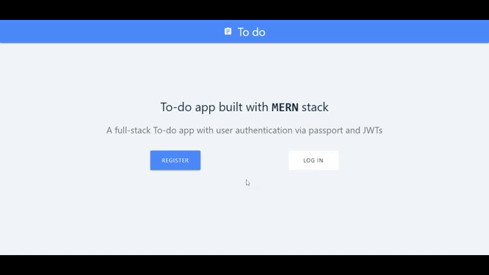

# To-do App

## Description

To-do web app built with MERN stack. 

- Frontend in ReactJS .
- Backend with NodeJS and ExpressJS.
- Database used MongoDB.
- Used JWT Token for authentication.

## Available Scripts

In the project directory, run:

### `npm install`

In frontend directory , run

### `npm install`

### `npm run dev`
